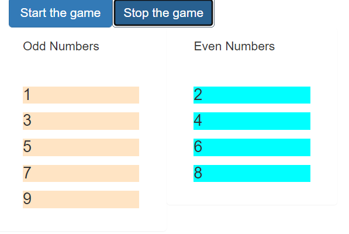

## Game controller exercise

The aim was to use three components

1. GameControl
2. Odd
3. Even

The game control should have two buttons to *start* and *stop* the game.

The Gamecontrol emits the odd and even numbers using the setTimer function.

The app componets stores the odd and even numbers in an array.

The odd and even apps are then processed in the for loop for the arrays.

The odd numbers and even numbers should be styled differently

Example result image 

  

